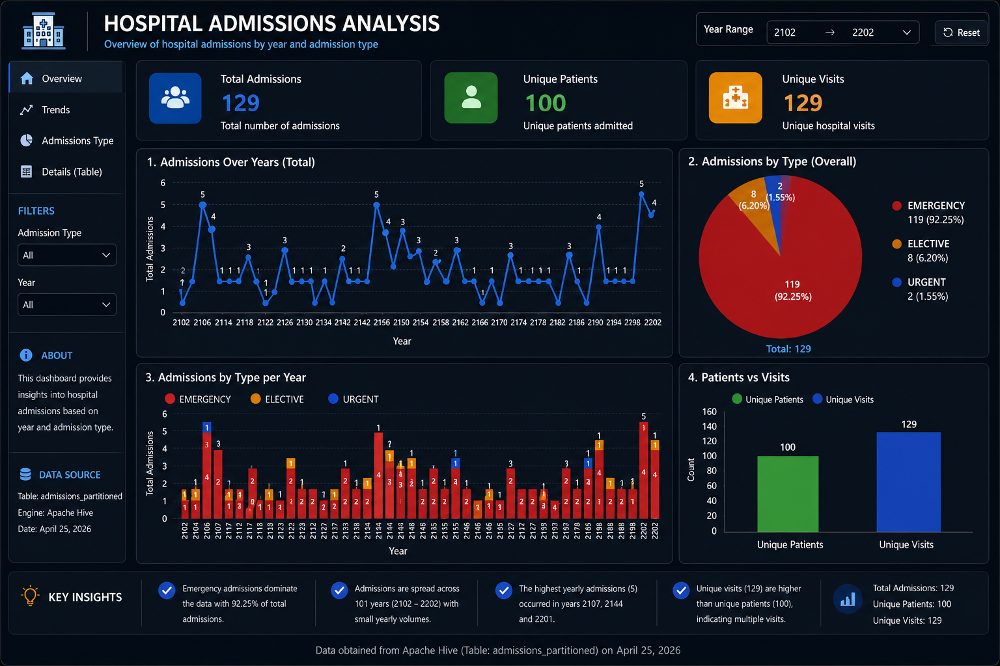

# 🏥 Hospital Admissions Data Pipeline (Hadoop + Hive + Docker)

End-to-end Data Engineering pipeline for processing and analyzing hospital admissions data using Hadoop, Hive, and Docker.

---

## 🎯 Problem Statement

Healthcare systems generate large volumes of admissions data.
The challenge is transforming this raw data into meaningful insights efficiently and at scale.

This project demonstrates how to build a scalable data pipeline to clean, store, and analyze hospital admissions data.

---

## 📌 Overview

This project builds an end-to-end data pipeline that transforms raw hospital admissions data into actionable insights using Hive and analytical queries.

---

## 📊 Data Source

Synthetic hospital admissions dataset inspired by real-world healthcare data.

---

## ⚙️ Tech Stack

* Hadoop
* Hive
* Docker
* Python

---

## 🏗️ Architecture

```
CSV → Python Cleaning → Hive Table → Analytical Queries → Dashboard
```

---

## 📂 Project Structure

* `data/` → raw data
* `scripts/` → data cleaning (Python)
* `queries/` → Hive queries
* `docker/` → docker-compose setup
* `dashboard/` → output visualization

---

## 🔄 Pipeline Steps

1. Clean raw data using Python
2. Load cleaned data into Hive
3. Run analytical queries
4. Generate insights

---

## 📌 Key Queries

* Admission count per year
* Admission type distribution (Emergency vs Elective)

---

## 📊 Sample Insights

* Total Admissions: 26
* Emergency: 24
* Elective: 2
* Years Covered: 2000 - 2022

---

## 🖼️ Dashboard Preview



---

## 🚀 How to Run

```bash
docker-compose up -d
```

---

## 💡 Future Improvements

* Integrate Apache Spark for faster processing
* Add Airflow for orchestration
* Connect to BI tools (Power BI / Tableau)

---

## 👨‍💻 Author

**Tharwat Farag**
Data Engineer | Big Data Enthusiast
